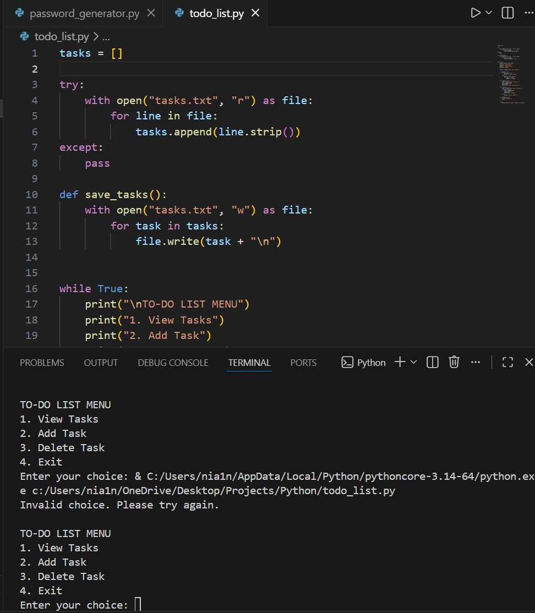

# Python To-Do List Application

This project is a simple To-Do List application built using Python.

## Features
- Add tasks
- View tasks
- Delete tasks
- Tasks are saved permanently using file handling

## Technologies Used
Python

## How to Run

Run the program using:

python todo_list.py

